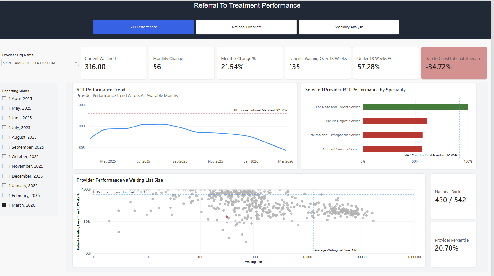
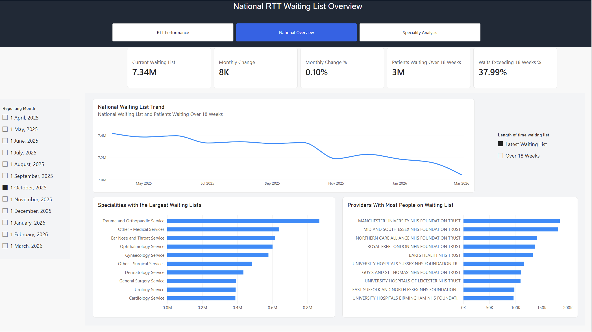
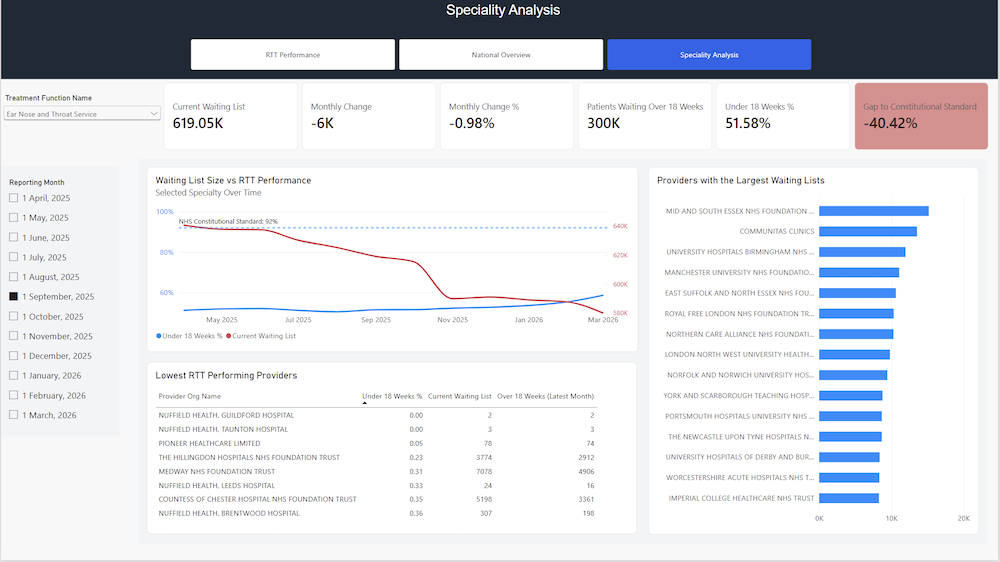

# NHS Referral to Treatment (RTT) Performance Analysis

## Overview

This project explores the NHS Referral to Treatment (RTT) waiting list using **Power BI**. In particular this report allows the user to explore which providers are meeting the NHS Constitutional Standard of seeing 92% of patients within 18 weeks, and which specialities are performing well.

## Tools Used

- Power BI  
- DAX
- Power Query

## Report Pages

### RTT Performance

Provides an executive overview of provider performance measured against the NHS Constitutional Standard.  

  

### National RTT Overview

Provides a national view of waiting list growth and service pressures. 

   

### Speciality Analysis

Allows detailed analysis of the individual specialities. 

  

## Insights Derived From Report

- This report allows the user to identify which providers are meeting the NHS Constitutional Standard, and provides further detail into what percentage of patients are seen within 18 weeks.
- The number of patients on the waiting list for over 18 weeks and overall is explored, showcasing which providers and specialities have the longest waiting lists.
- Investigates changes in waiting list times over a 12 month period.  

## Data Source

- The raw data is publicly available from https://www.england.nhs.uk/statistics/statistical-work-areas/rtt-waiting-times/rtt-data-2025-26/ and was transformed using **Power Query**. The dates were from April 2025 to March 2026. 
- The data was modelled using a star schema with 4 dimension tables for details about date, provider, speciality and RTT pathway type.
- The relationships were optimised for time intelligence calculations, as well as for proving benchmarks for both specialities and providers.  
